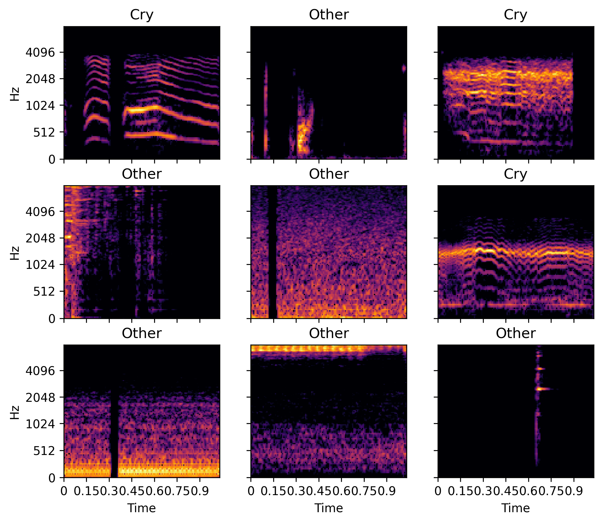
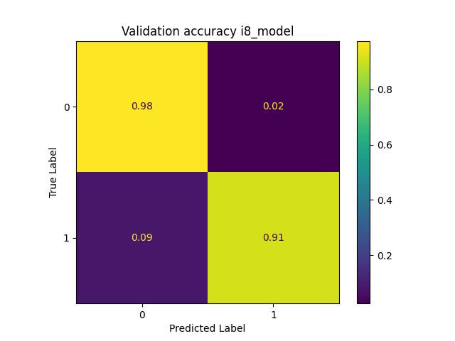

# CryBabyCry
MLoMCU Project - Quantized audio processing model for detecting baby cry on STM32L4



## Usage
### Training the model
```bash
$ make
```
or
```bash
$ python main.py
```

### Validation on the MCU:

Connect MCU with USB and attach FTDI to UART4 interface for transfering audio samples.

Start data server
```bash
$ python validate_mcu.py
```

Start CryBabyCry in Validation mode.


## Accuracy
Model accuracy after post-training quantization.



